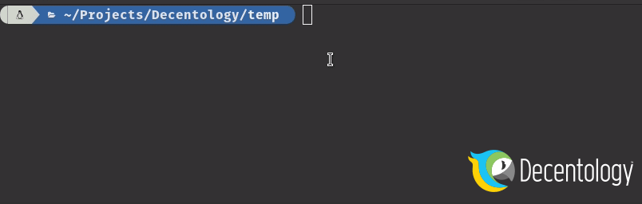

# DappStarter CLI

## Download DappStarter CLI

Install the CLI using `npm install -g @decentology/dappstarter`&#x20;

You can go to releases to pull the latest binary compiled version and add installation location to your system's PATH.

| System  | File                                                                                                               |
| ------- | ------------------------------------------------------------------------------------------------------------------ |
| Linux   | [**dappstarter\_linux**](https://github.com/trycrypto/dappstarter-cli/releases)****                                |
| Mac     | [**dappstarter\_osx**](https://github.com/trycrypto/dappstarter-cli/releases)****                                  |
| Windows | ****[**dappstarter.exe** or **dappstarter\_setup.exe**](https://github.com/trycrypto/dappstarter-cli/releases)**** |

## Using DappStarter CLI



#### Basic usage

```
dappstarter create
```

#### Save configuration only

```
dappstarter create -w config.json
```

#### Create from configuration

```
dappstarter create -c config.json
```

## Help

```
Usage: dappstarter create [options]

Options:
  -c, --config <file>        Loads configuration from file and processes.
  -o, --output <path>        Output directory. If omitted current directory will be used.
  -w, --write-config [path]  Writes configuration to file without processing.
  -p, --print-config         Echos configuration to terminal without processing.
  -h, --help                 display help for command
```
